# Phase 3: Core Logic Flow — Multi-Endpoint Interaction & Error Handling

> System Design + User Journey for the highest-frequency, most error-prone MVP scenario:
> **"User copies an analyst on App → Analyst places a bet → System mirrors the bet to Kalshi/Polymarket"**

---

## Participants

| Node | Role | Failure Risk |
|---|---|---|
| **App UI** | User-facing web/mobile client | Network loss, stale data |
| **Cloud Server** | Gainr backend (auth, copy engine, order routing) | Downtime, race conditions |
| **Market API** | Kalshi / Polymarket order API | Offline, order rejected, odds drift, market closed |

---

## Sequence Diagram

```mermaid
sequenceDiagram
    autonumber
    participant UI as App UI
    participant SRV as Cloud Server
    participant MKT as Market API<br/>(Kalshi / Polymarket)

    %% ═══════════════════════════════════════
    %% FLOW A: User Copies an Analyst
    %% ═══════════════════════════════════════
    rect rgb(255, 247, 237)
    Note over UI,MKT: Flow A — User Initiates Copy
    UI->>UI: User taps "Copy This Analyst"
    UI->>UI: Show Copy Amount Modal
    UI->>SRV: POST /copy {analystId, amount}
    SRV->>SRV: Validate balance ≥ amount
    alt Insufficient Balance
        SRV-->>UI: 400 INSUFFICIENT_BALANCE
        UI->>UI: Red toast: "Insufficient balance"
        UI->>UI: Highlight Deposit button (pulse)
    else Balance OK
        SRV->>MKT: GET /account/status (health check)
        alt Market API Offline
            MKT--xSRV: TIMEOUT / 5xx
            SRV-->>UI: 503 MARKET_UNREACHABLE
            UI->>UI: Orange banner: "Market temporarily unavailable"
            UI->>UI: Disable Confirm button
            UI->>UI: Show "Retry in 30s" countdown
        else Market API Online
            SRV->>SRV: Create CopySubscription record
            SRV->>SRV: Reserve funds (hold, not debit)
            SRV-->>UI: 201 COPY_ACTIVE {subscriptionId}
            UI->>UI: Swap button → "Copying ✓" badge
            UI->>UI: Green toast: "Now copying [Analyst]"
        end
    end
    end

    %% ═══════════════════════════════════════
    %% FLOW B: Analyst Places a Bet → Mirror
    %% ═══════════════════════════════════════
    rect rgb(237, 247, 255)
    Note over UI,MKT: Flow B — Mirrored Bet Execution
    SRV->>SRV: Detect analyst new position via webhook/poll
    SRV->>SRV: Calculate proportional bet per copier
    SRV->>SRV: Check each copier's reserved balance
    alt Copier Balance Insufficient for Mirror
        SRV-->>UI: WS push: MIRROR_SKIPPED {reason: "balance"}
        UI->>UI: Yellow card: "Skipped — top up to stay in sync"
    else Balance OK
        SRV->>MKT: POST /orders {market, side, amount}
        alt Market API Offline (突然离线)
            MKT--xSRV: TIMEOUT / 5xx / ECONNREFUSED
            SRV->>SRV: Mark order PENDING_RETRY
            SRV->>SRV: Enqueue retry (exp. backoff: 10s→30s→60s)
            SRV-->>UI: WS push: MIRROR_DELAYED {eta}
            UI->>UI: Pulsing orange dot on position card
            UI->>UI: "Placing bet… market delayed" label
            loop Retry (max 3 attempts)
                SRV->>MKT: POST /orders (retry)
                alt Still Offline
                    MKT--xSRV: TIMEOUT
                    SRV->>SRV: Increment retry counter
                else Recovered
                    MKT-->>SRV: 200 ORDER_FILLED {orderId, fillPrice}
                    SRV->>SRV: Debit from reserved funds
                    SRV-->>UI: WS push: MIRROR_FILLED {orderId, price}
                    UI->>UI: Green dot replaces orange
                    UI->>UI: Update portfolio balances
                end
            end
            alt All Retries Exhausted
                SRV->>SRV: Mark order FAILED
                SRV->>SRV: Release reserved funds
                SRV-->>UI: WS push: MIRROR_FAILED
                UI->>UI: Red banner: "Bet failed — funds returned"
                UI->>UI: Show "View Details" → failure reason
                UI->>UI: Disable further mirrors until user acknowledges
            end
        else Order Rejected (odds drift / market closed)
            MKT-->>SRV: 422 ORDER_REJECTED {reason}
            SRV-->>UI: WS push: MIRROR_REJECTED {reason}
            UI->>UI: Red toast: "Market closed" or "Odds moved >5%"
            UI->>UI: Show analyst's original position for manual action
        else Order Filled Successfully
            MKT-->>SRV: 200 ORDER_FILLED {orderId, fillPrice}
            SRV->>SRV: Debit from reserved funds
            SRV->>SRV: Log fill price vs analyst price (slippage)
            SRV-->>UI: WS push: MIRROR_FILLED {orderId, price, slippage}
            UI->>UI: Green toast: "Bet mirrored ✓"
            UI->>UI: New row in Active Bets list
            UI->>UI: Update Balance / Invested cards
        end
    end
    end

    %% ═══════════════════════════════════════
    %% FLOW C: Market Settles → Payout
    %% ═══════════════════════════════════════
    rect rgb(237, 255, 242)
    Note over UI,MKT: Flow C — Settlement
    MKT-->>SRV: Webhook: MARKET_RESOLVED {outcome}
    SRV->>SRV: Calculate payout per copier position
    SRV->>SRV: Credit winnings / zero out losses
    SRV-->>UI: WS push: BET_SETTLED {pnl}
    UI->>UI: Move bet from Active → History
    UI->>UI: Update Returns card (+/- pnl)
    UI->>UI: Update analyst Winning Periods metric
    end
```



---

## Error Taxonomy

| Error Code | Trigger | Server Action | UI Response |
|---|---|---|---|
| `INSUFFICIENT_BALANCE` | Copy or mirror amount > available | Reject, no state change | Red toast + pulse Deposit button |
| `MARKET_UNREACHABLE` | API timeout on health check | Block copy activation | Orange banner + disable Confirm + retry countdown |
| `MIRROR_DELAYED` | API timeout during order placement | Queue retry (exp. backoff, max 3) | Pulsing orange dot + "market delayed" label |
| `MIRROR_FAILED` | All retries exhausted | Release reserved funds | Red banner + "funds returned" + require acknowledgement |
| `ORDER_REJECTED` | Odds drift >5% or market closed | Log rejection, notify user | Red toast + show analyst position for manual action |
| `MIRROR_SKIPPED` | Copier balance too low for proportional bet | Skip this copier only | Yellow card + "top up" CTA |
| `SLIPPAGE_WARNING` | Fill price differs >2% from analyst | Fill anyway, log delta | Subtle slippage badge on position card |

---

## UI Error States — Visual Hierarchy

```
🔴 BLOCKING (Red)     — Stops the flow, requires user action
   • Insufficient balance
   • Mirror failed (all retries exhausted)
   • Order rejected (market closed)

🟠 DEGRADED (Orange)  — Flow continues, user informed
   • Market temporarily unreachable
   • Mirror delayed (retrying)

🟡 WARNING (Yellow)   — Non-blocking, advisory
   • Mirror skipped (low balance)
   • Slippage detected

🟢 SUCCESS (Green)    — Happy path confirmation
   • Copy activated
   • Bet mirrored
   • Bet settled
```

---

## Critical Design Decisions

| Decision | Choice | Rationale |
|---|---|---|
| Fund model | **Reserve on copy, debit on fill** | Prevents overselling; user sees "available" vs "reserved" |
| Retry strategy | **Exponential backoff, max 3** | Balances speed vs API abuse; 10s→30s→60s |
| Odds drift threshold | **5% max slippage** | Beyond 5%, auto-reject — analyst's edge may not apply |
| Offline acknowledgement | **User must dismiss failure** | Prevents silent fund drain if API is persistently down |
| Mirror proportion | **Pro-rata to copy amount** | $100 copy on $1000 analyst bank → 10% of analyst's bet size |
