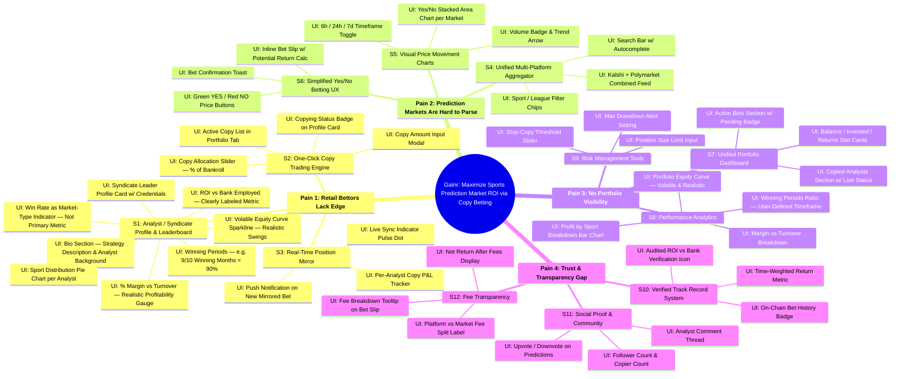

# Product Opportunity Tree — Gainr Copy Betting Platform

> Opportunity Solution Tree (OST) for a sports prediction market copy-betting app targeting Kalshi / Polymarket.

## Mermaid Mindmap

## Legend

| Layer | Description |
|---|---|
| **Root** | Core business objective |
| **Pain 1–4** | Segmented user pain points (Opportunities) |
| **S1–S12** | Software feature solutions |
| **UI:** | App-level UI presentation nodes |

## Key Metric Definitions

| Metric | Meaning | Why It Matters |
|---|---|---|
| **ROI vs Bank** | Return relative to total bankroll deployed | Primary performance measure; must be clearly labeled to avoid confusion with per-bet ROI |
| **% Margin vs Turnover** | Profit ÷ total wagered amount | Much lower number than ROI vs bank; shows realistic edge — serious bettors expect this |
| **Winning Periods** | % of user-defined periods (months) in profit | e.g. "9/10 winning months = 90%" — shows consistency, not just cumulative return |
| **Win Rate** | % of individual bets won | Indicates market type played (low win rate = long-shot markets, high = favorites); not a standalone success metric |

## Current Codebase Coverage

| Solution | Status |
|---|---|
| S1 Analyst Profile & Leaderboard | Partial — static mock data, no bio/strategy, missing margin & winning periods metrics |
| S2 One-Click Copy | Partial — client-side only, no persistence |
| S4 Aggregator | Not started — hardcoded markets |
| S5 Price Charts | Done — Area chart with Yes/No |
| S6 Yes/No Betting UX | Done — buttons + inline bet slip |
| S7 Portfolio Dashboard | Partial — stat cards + lists, no real data |
| S3, S8–S12 | Not started |
